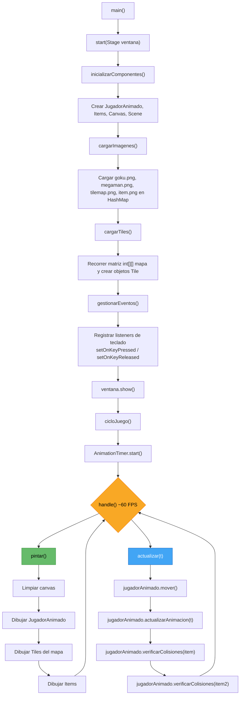

# Documentación del Proyecto Videojuego
Hecho por David Fernando López Urquia 20231003223

Este proyecto es un videojuego 2D basado en **Java** y **JavaFX**. Está organizado en dos paquetes principales:

- `com.unah`: clases del juego, enemigos, proyectiles, efectos y la aplicación principal.
- `com.unah.clases`: clases de apoyo como animaciones, tiles, jugador animado, items y texto flotante.

Es una base ideal para aprender programación orientada a objetos y extender el juego.

---

## ▶️ Cómo ejecutar

```bash
mvn clean javafx:run
```

También puedes ejecutar la clase `com.unah.App` desde tu IDE.

---

## 📁 Estructura de paquetes

```
com.unah
├── App.java
├── ObjetoJuego.java
├── Nave.java
├── Proyectil.java
├── Particula.java
├── Enemigo.java
├── EnemigoKamikaze.java
├── EnemigoPesado.java
├── EnemigoCazador.java
├── GestorPuntuaciones.java
└── com.unah.clases
    ├── Animacion.java
    ├── Item.java
    ├── Jugador.java
    ├── JugadorAnimado.java
    ├── Tile.java
    └── PuntosFlotantes.java
```

---

## 🧱 Herencia y relaciones

### Herencia principal

- `ObjetoJuego` (abstracta)
  - `Nave`
    - `Jugador`
  - `Proyectil`
  - `Enemigo` (abstracta)
    - `EnemigoKamikaze`
    - `EnemigoPesado`
    - `EnemigoCazador`

### Composición y uso

- `App` contiene y usa instancias de `Nave`, `Proyectil`, `Enemigo`, `Tile`, `Particula`, `PuntosFlotantes`, `Item` y `JugadorAnimado`.
- `JugadorAnimado` usa `Animacion` para calcular frames del spritesheet.
- `GestorPuntuaciones` administra el archivo `puntuaciones.txt`.

---

## 🧩 Descripción de clases

### `App.java`

Clase principal que configura JavaFX y controla el juego.

Responsabilidades principales:

- Inicializar ventana, canvas y recursos.
- Cargar imágenes en `App.imagenes`.
- Gestionar teclado y eventos.
- Crear y actualizar objetos del juego.
- Ejecutar el ciclo de juego con `AnimationTimer`.
- Gestionar menú de inicio, game over y puntuaciones.

### `ObjetoJuego.java`

Clase abstracta base para objetos que se mueven y dibujan en pantalla.

Campos clave:

- `x`, `y`: posición.
- `ancho`, `alto`: tamaño.
- `indiceImagen`: clave para buscar imagen en `App.imagenes`.
- `velocidad`.
- `activo`: indica si el objeto sigue vigente.

Métodos:

- `mover()` (abstracto).
- `pintar(GraphicsContext graficos)`.
- `obtenerRectangulo()`.

### `Nave.java`

Representa la nave jugable.

Funciones:

- Movimiento con flechas.
- Disparo con `disparar()`.
- Control de `puntuacion` y `vidas`.
- Reset de posición.

### `Jugador.java`

Extiende `Nave` y añade lógica de animación y física de movimiento adicional.

Funciones específicas:

- Estado visual según entrada: estática, propulsión completa, fase intermedia, diagonal izquierda/derecha.
- Movimiento vertical con anclaje en la mitad de la pantalla.
- Activa la bandera `App.empujandoMapa` para mover el fondo.
- Colisión con caja más ajustada para el jugador.

### `JugadorAnimado.java`

Clase alternativa para jugador animado con spritesheet.

Funciones:

- Mueve el jugador según entrada.
- Usa `Animacion` para seleccionar el frame adecuado.
- Dibuja sólo el fragmento activo de la imagen.
- Verifica colisiones con `Item`.

No hereda de `ObjetoJuego`.

### `Enemigo.java`

Clase abstracta para enemigos.

Campos adicionales:

- `energia`: vida del enemigo.
- `puntosOtorgados`.
- `colorExplosion`: color de partículas al ser destruido.
- `xInicial`: base para el zigzag.

Métodos:

- `recibirDano(int)`.
- `dispararEnemigo()`.
- `mover()` con zigzag.

### `EnemigoKamikaze.java`

Enemigo rápido que baja en línea recta.

Características:

- Velocidad alta.
- Se desactiva al salir de pantalla.
- Imagen `enemigo_kamikaze`.

### `EnemigoPesado.java`

Enemigo lento y resistente.

Características:

- Movimiento en onda usando `Math.sin()`.
- Más vida y mayor puntuación.
- Color de explosión rojo.

### `EnemigoCazador.java`

Enemigo que persigue la nave.

Características:

- Ajusta su posición `x` hacia la `Nave` objetivo.
- Se mueve lentamente hacia abajo.
- Color de explosión verde.

### `Proyectil.java`

Proyectil del jugador.

Características:

- Baja por `y -= velocidad`.
- Se desactiva al salir de pantalla.
- Dibuja un rectángulo `Cyan` en vez de una imagen.

### `Particula.java`

Partícula de explosión.

Características:

- Movimiento aleatorio.
- Vida y opacidad decrecientes.
- Dibujo con transparencia.

No hereda de `ObjetoJuego`.

### `Tile.java`

Bloque o elemento de fondo.

Funciones:

- Dibuja tiles recortados desde un spritesheet.
- También soporta imágenes completas.
- Varios constructores para tiles tipo sprite y objetos individuales.

### `Item.java`

Objeto coleccionable.

Características:

- Tiene posición, tamaño y estado `capturado`.
- Dibuja su sprite si no está capturado.
- Devuelve un rectángulo para colisiones.

No hereda de `ObjetoJuego`.

### `Animacion.java`

Clase auxiliar para animaciones por frames.

Funciones:

- Guarda los rectángulos de cada frame.
- Calcula el frame actual según un tiempo `t`.
- Retorna las coordenadas del frame activo.

### `PuntosFlotantes.java`

Texto animado que sube y desaparece.

Funciones:

- Mueve el texto hacia arriba.
- Reduce opacidad con el tiempo.
- Se desactiva tras su duración.

No hereda de `ObjetoJuego`.

### `GestorPuntuaciones.java`

Administra el archivo `puntuaciones.txt`.

Funciones:

- Leer puntuaciones.
- Guardar un nuevo puntaje.
- Mantener el Top 10.
- Verificar si un puntaje entra en el ranking.

---

## 💡 Diseño general

- `App.imagenes` es un `HashMap<String, Image>` compartido entre muchas clases.
- `ObjetoJuego` centraliza movimiento, dibujo y colisión para objetos jugables.
- Las clases de efectos y utilidades (`Particula`, `PuntosFlotantes`, `GestorPuntuaciones`, `Animacion`, `Item`) se usan por composición.
- `Jugador` extiende `Nave`, mientras que `JugadorAnimado` es una alternativa independiente para animaciones con spritesheet.

---

## ✅ Ideas para ampliar el juego

- Añadir más tipos de enemigos y patrones de movimiento.
- Implementar power-ups coleccionables.
- Agregar niveles con mapas más grandes.
- Unificar clases de efectos en una jerarquía común.
- Añadir sonido de disparo y explosión adicionales.

---

## 🔍 Descripción de Clases

### `App` — Clase Principal

La clase `App` extiende `Application` de JavaFX y es el **punto de entrada** del juego. Aquí se orquesta todo:

| Responsabilidad | Método |
|---|---|
| Configurar la ventana, canvas y escena | `start()`, `inicializarComponentes()` |
| Cargar todas las imágenes en un `HashMap` global | `cargarImagenes()` |
| Construir el mapa a partir de la matriz 2D | `cargarTiles()` |
| Capturar entrada del teclado (flechas, espacio) | `gestionarEventos()` |
| Ejecutar el **game loop** con `AnimationTimer` | `cicloJuego()` |
| Dibujar todos los elementos en cada frame | `pintar()` |
| Actualizar movimiento, animaciones y colisiones | `actualizar()` |

Las teclas presionadas se almacenan en variables estáticas (`derecha`, `izquierda`, `arriba`, `abajo`) que las demás clases consultan para mover al jugador.

---

### `Jugador` — Jugador Básico (sin animación)

Representa un personaje controlable que se mueve con las flechas del teclado y se dibuja usando una **imagen estática completa** (por ejemplo `goku.png`).

- **Movimiento**: Lee las variables estáticas de `App` para determinar la dirección.
- **Renderizado**: Usa `drawImage()` con la imagen completa.
- **Wrapping**: Si el jugador sale por la derecha (x >= 1100), reaparece por la izquierda.

> 💡 Esta clase es una versión simplificada que sirve como introducción antes de pasar a `JugadorAnimado`.

---

### `JugadorAnimado` — Jugador con Animaciones

Versión avanzada del jugador que soporta **múltiples animaciones** basadas en spritesheet. En lugar de dibujar la imagen completa, recorta un **fragmento rectangular** que cambia con el tiempo.

- **Animaciones**: Usa un `HashMap<String, Animacion>` para almacenar animaciones por nombre (`"correr"`, `"descanso"`).
- **Renderizado**: Usa la versión de `drawImage()` con 9 parámetros para recortar y dibujar solo el frame actual del spritesheet.
- **Colisiones**: Genera un `Rectangle` con sus dimensiones actuales y verifica intersección con items.
- **Puntuación**: Lleva un contador interno que incrementa al recoger items.

```java
// drawImage con recorte de spritesheet:
graficos.drawImage(imagen,
    xImagen, yImagen, anchoImagen, altoImagen,  // Región fuente (spritesheet)
    x, y, anchoImagen, altoImagen                // Región destino (pantalla)
);
```

---

### `Animacion` — Sistema de Animación por Frames

Controla la lógica de animación calculando **qué frame mostrar en cada momento** según el tiempo transcurrido.

- **`coordenadasImagenes[]`**: Array de `Rectangle` donde cada rectángulo define la posición (x, y) y tamaño (ancho, alto) de un frame dentro del spritesheet.
- **`duracion`**: Tiempo en segundos que se muestra cada frame (ej: `0.05` = 20 FPS de animación).
- **`calcularFrame(double t)`**: Fórmula clave que determina el frame actual:

```java
frameActual = (int)((t % (cantidadFrames * duracion)) / duracion);
```

Esta fórmula usa el **módulo** para crear un ciclo continuo: cuando llega al último frame, vuelve al primero automáticamente.

---

### `Tile` — Bloque del Escenario

Representa un **bloque individual** del mapa. Cada tile recorta una región específica del tileset (`tilemap.png`) según su tipo.

- **Constructor por tipo**: Recibe un entero (`tipoTile`) y configura las coordenadas de recorte con un `switch`:
  - Tipo `1`: Tile en posición (0, 0) del tileset
  - Tipo `2`: Tile en posición (0, 70)
  - Tipo `4`: Tile en posición (490, 558) — pared lateral
  - Tipo `5`: Tile en posición (560, 558) — esquina
  - Tipo `6`: Tile en posición (560, 698) — esquina superior
  - Tipo `666`: Tile especial en posición (70, 558)
- **Tamaño**: Todos los tiles son de **70×70 píxeles**.
- **Renderizado**: Igual que `JugadorAnimado`, usa `drawImage()` con recorte.

---

### `Item` — Objeto Coleccionable

Representa un **objeto que el jugador puede recoger** (como monedas, estrellas, power-ups, etc.).

- **Estado**: Tiene un booleano `capturado` que controla si ya fue recogido.
- **Renderizado**: Solo se dibuja si **no** ha sido capturado.
- **Colisión**: Genera un `Rectangle` de 18×18 píxeles para detección de colisiones.

---

## 🎯 Flujo de Ejecución



---

## 💡 Ideas para Extender el Proyecto

- **Gravedad y saltos**: Agregar física básica al jugador.
- **Colisiones con tiles**: Evitar que el jugador atraviese las paredes.
- **Enemigos**: Crear una clase `Enemigo` con movimiento autónomo.
- **Niveles**: Cargar diferentes mapas desde archivos externos.
- **Sonido**: Agregar efectos de sonido y música de fondo con `javafx.scene.media`.
- **Menús**: Pantalla de inicio, game over y pausa.
- **Cámara/Scroll**: Mover la vista del mapa cuando el jugador avanza.
- **Más animaciones**: Agregar animaciones de salto, ataque, muerte, etc.
- **Herencia**: Hacer que `JugadorAnimado` extienda de `Jugador` para reutilizar código.

---

## 📝 Notas Técnicas

- Las imágenes se almacenan en un `HashMap<String, Image>` estático en `App` para acceso global.
- El `Canvas` tiene un tamaño de **1000×500 píxeles**.
- La clase `Jugador` está comentada en `App.java` pero disponible como referencia didáctica.
- El proyecto usa **módulos de Java** (`module-info.java`) requiriendo `javafx.controls` y `javafx.fxml`.
